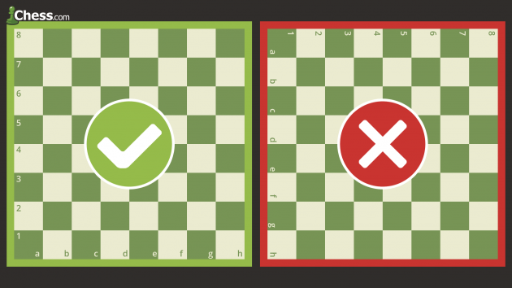
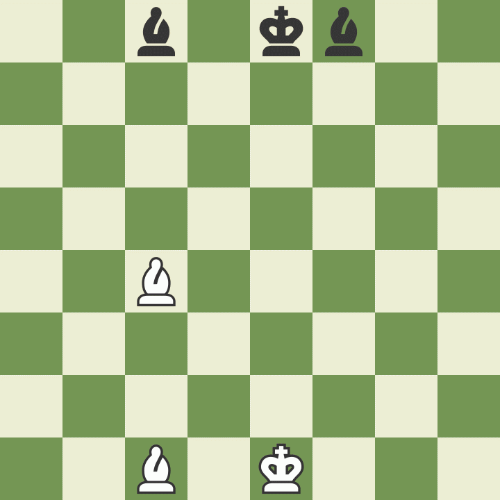

# Instructions

## Paso 1. Cómo configurar el tablero de ajedrez
Al comienzo del juego, el tablero de ajedrez se coloca de modo que cada jugador tenga el cuadrado de color blanco (o claro) en la parte inferior derecha.

### Configurar tablero de ajedrez
Luego, las piezas de ajedrez se ordenan de la misma manera cada vez. La segunda fila (o rango) está llena de peones. Las torres van en las esquinas, luego los caballos junto a ellos, seguidos por los alfiles, y finalmente la reina, que siempre va en su propio color a juego (reina blanca sobre blanco, reina negra sobre negro), y el rey sobre el resto. cuadrado.

## Paso 2. Cómo se mueven las piezas de ajedrez
* Cada uno de los 6 tipos diferentes de piezas se mueve de manera diferente. 
* Las piezas no pueden moverse a través de otras piezas (aunque el caballo puede saltar sobre otras piezas) y 
* ... nunca puede moverse a una casilla con una de sus propias piezas
* ... sin embargo, pueden moverse para tomar el lugar de una pieza del oponente que luego es capturada. 
* Las piezas generalmente se mueven a posiciones donde pueden capturar otras piezas (aterrizando en su casilla y luego reemplazándolas), defender sus propias piezas en caso de captura, o controlar casillas importantes en el juego.

### Cómo mover al rey en el ajedrez
* El rey es la pieza más importante, pero es una de las más débiles. El rey solo puede mover una casilla en cualquier dirección: arriba, abajo, a los lados y en diagonal.
* El rey nunca puede ponerse en jaque (donde podría ser capturado). Cuando el rey es atacado por otra pieza, esto se llama "jaque".

### Cómo mover a la reina en el ajedrez
* La reina es la pieza más poderosa.
* Puede moverse en cualquier dirección recta (hacia adelante, hacia atrás, hacia los lados o en diagonal) lo más lejos posible siempre que no se mueva a través de ninguna de sus propias piezas.
* Y, como con todas las piezas, si la reina captura una pieza del oponente, su movimiento termina. Observe cómo la reina blanca captura a la reina negra y luego el rey negro se ve obligado a moverse.

### Cómo mover la torre en el ajedrez
* La torre puede moverse tanto como quiera, pero solo hacia adelante, hacia atrás y hacia los lados.
* ¡Las torres son piezas particularmente poderosas cuando se protegen entre sí y trabajan juntas!

### Cómo mover al alfil en el ajedrez
* El alfil puede moverse tanto como quiera, pero solo en diagonal. 
* Cada obispo comienza con un color (claro u oscuro) y siempre debe permanecer en ese color.
* Los obispos trabajan bien juntos porque ocultan las debilidades de los demás.

### Cómo mover al caballo en el ajedrez
* Los caballos se mueven de una manera muy diferente a las otras piezas: 
* van dos cuadrados en una dirección y 
* luego uno más se mueve en un ángulo de 90 grados, como la forma de una "L".
* Los caballos también son las únicas piezas que pueden moverse sobre otras piezas.

### Cómo mover el peón en el ajedrez
* Los peones son inusuales porque se mueven y capturan de diferentes maneras: avanzan, pero capturan en diagonal. 
* Los peones solo pueden avanzar una casilla a la vez, excepto en su primer movimiento en el que pueden avanzar dos casillas.
* Los peones solo pueden capturar un cuadrado en diagonal frente a ellos. Nunca pueden moverse o capturar al revés. Si hay otra pieza directamente enfrente de un peón, no puede pasar ni capturar esa pieza.

## Paso 3. Descubra quién da el primer paso en el ajedrez
El jugador con las piezas blancas siempre se mueve primero. Por lo tanto, los jugadores generalmente deciden quién llegará a ser blanco por casualidad o suerte, como lanzar una moneda o hacer que un jugador adivine el color del peón oculto en la mano del otro jugador. Las blancas luego hacen un movimiento, seguido por las negras, luego las blancas nuevamente, luego las negras y así sucesivamente hasta el final del juego. Poder moverse primero es una pequeña ventaja que le da al jugador blanco la oportunidad de atacar de inmediato.

## Paso 4. Descubra quién da el primer paso en el ajedrez
Hay varias formas de terminar una partida de ajedrez: con jaque mate, con tablas, con resignación, perdiendo a tiempo ...

### Cómo hacer jaque mate en el ajedrez
* El propósito del juego es hacer jaque mate al rey del oponente. Esto sucede cuando el rey se pone en jaque y no puede salir de jaque.
